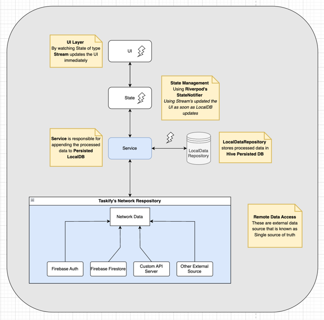

# Taskify Project 

# Architecture:
The Taskify application follows a layered architecture designed for scalability, maintainability, and a clear separation of concerns. The data flows unidirectionally, ensuring a predictable state management and data synchronization process.



The architecture is composed of the following layers:

### 1. UI Layer
-   **Responsibility**: To render the user interface.
-   **Mechanism**: It listens to a `Stream` of `State` objects. Whenever a new state is emitted, the UI layer rebuilds immediately to reflect the changes. This ensures that the UI is always a direct representation of the application's current state.

### 2. State Management
-   **Responsibility**: To manage the application's state and notify the UI of any updates.
-   **Technology**: It utilizes Riverpod's `StateNotifier`.
-   **Mechanism**: The `StateNotifier` is updated with the latest data from the `LocalDB`. It then emits a new state object, which is picked up by the listening UI layer. This update happens as soon as the local database changes, ensuring a reactive and efficient UI.

### 3. Service Layer
-   **Responsibility**: To handle business logic and process data.
-   **Mechanism**: The Service layer is responsible for appending processed data to the persistent `LocalDB`. It acts as an intermediary between the data sources and the local database.

### 4. Local Data Repository
-   **Responsibility**: To store processed data in a persistent local database, making it available for offline use and providing a single source of truth for the application's state.
-   **Technology**: The implementation uses the `hive` database.
-   **Mechanism**: It stores the data provided by the Service layer. Any changes in this repository trigger the update flow that ultimately reaches the UI.

### 5. Network Repository (Remote Data Access)
-   **Responsibility**: To fetch data from all external sources. This layer is considered the ultimate source of truth from which the local data is synchronized.
-   **Components**:
  -   **Firebase Auth**: Handles user authentication.
  -   **Firebase Firestore**: Used as a real-time NoSQL cloud database.
  -   **Custom API Server**: For fetching data from a backend server.
  -   **Other External Sources**: Can be any other third-party API or data source.

---

# Setup Guide

This guide provides a comprehensive walkthrough for setting up the Taskify Flutter project, from installing prerequisites to running the application.

---

## 1. Prerequisites

Before you begin, ensure you have the necessary tools installed on your system.

### **Install FVM (Flutter Version Manager)**
FVM allows you to manage multiple Flutter SDK versions on your machine.
```bash
curl -fsSL [https://fvm.app/install.sh](https://fvm.app/install.sh) | bash
```

### **Install Firebase CLI**
The Firebase Command Line Interface is essential for interacting with your Firebase projects.
```bash
brew install firebase-cli
```

### **Activate Global Dart Packages**
Activate `melos` for managing multi-package repositories and `spider` for asset generation.
```bash
fvm flutter pub global activate melos
fvm flutter pub global activate spider
```
---

## 2. Firebase & Flutter Project Configuration

Next, set up your Firebase project and link it to your local Flutter application.

### **Log in to Firebase**
Authenticate with your Google account to access your Firebase projects.
```bash
firebase login
```

### **Configure Firebase in Your Project**
This command configures your Flutter project to connect with Firebase. It will prompt you to select the correct Firebase project.

- When prompted, create three apps within your Firebase project: **Android**, **iOS**, and **web**.
- Use `com.taskify.app` as the package name for all platforms.
- In the Firebase console, navigate to **Authentication** > **Sign-in method** and enable the **Google** provider.

Run the following command to begin:
```bash
flutterfire configure
```

### **Define Environment Variables**
Create a `dev.define.json` file inside the `packages/app` directory. This file will store environment-specific configurations.

To get your `GOOGLE_WEB_CLIENT_ID` and `GOOGLE_SERVER_CLIENT_ID`:
1. Go to the [Google Cloud Console](https://console.cloud.google.com/).
2. Navigate to **APIs & Services** > **Credentials**.
3. Find your OAuth 2.0 Client IDs.
4. Configure the OAuth consent screen and add the following scopes:
  - `/auth/userinfo.profile`
  - `/auth/user.birthday.read`

```json
// packages/app/dev.define.json
{
  "APP_NAME": "Taskify",
  "APP_SUFFIX": ".dev",
  "BASE_URL": "http://<YOUR_IP>:<PORT>/api/v1",
  "ENVIRONMENT": "dev",
  "GOOGLE_WEB_CLIENT_ID": "<YOUR_GOOGLE_WEB_CLIENT_ID>",
  "GOOGLE_SERVER_CLIENT_ID": "<YOUR_GOOGLE_SERVER_CLIENT_ID>"
}
```

---

## 3. Android Keystore & Signing Configuration

Configure the Java Keystore required to sign your Android application for release builds.

### **Generate Keystore**
This command creates a new keystore file. You will be prompted to set a store password and a key password.
```bash
keytool -genkey -v \
  -keystore ~/taskify-key.jks \
  -keyalg RSA \
  -keysize 2048 \
  -validity 10000 \
  -alias taskify
```

### **Create Key Properties File**
Create a file named `key.properties` inside the `packages/app/android` directory. Add the credentials for the keystore you just created.

```properties
# packages/app/android/key.properties
storePassword=<YOUR_STORE_PASSWORD>
keyPassword=<YOUR_KEY_PASSWORD>
keyAlias=taskify
storeFile=~/taskify-key.jks
```

### **Generate SHA Fingerprints**
Generate the SHA-1 and SHA-256 fingerprints and add them to the Android app configuration in your Firebase project settings.
```bash
cd packages/app/android && ./gradlew signingReport && cd ../../..
```

---

## 4. Melos & Final Setup

Bootstrap the project dependencies and run the final generation scripts using Melos.

### **Configure Melos Script**
In your `melos.yaml` file at the project root, update the `flutterfire` script. Copy the **Web App ID** from your Firebase project settings and paste it in place of `<WEB_APP_ID>`.

```yaml
# melos.yaml
scripts:
  firebase:configure:
    run: |
      flutterfire configure -p <PROJECT-NAME> \
        --platforms android,ios,web \
        -a com.taskify.app \
        -i com.taskify.app \
        -m com.taskify.app \
        -w <WEB_APP_ID> \
        -y
```

### **Bootstrap and Generate Files**
Run these commands to link all local packages and generate necessary files.
```bash
melos bs
melos gen:firebase
melos gen
```

---

## 5. Run the Project

You are now ready to run the Taskify app. Use the `--dart-define-from-file` flag to load the environment configuration you created earlier.
```bash
fvm flutter run --dart-define-from-file=packages/app/dev.define.json
